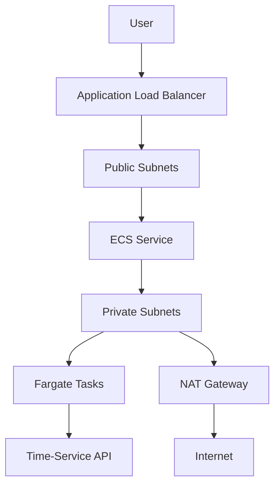
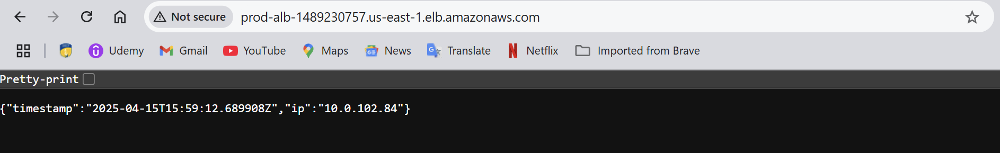

# Particle41-task

[](https://aws.amazon.com)
[](https://www.terraform.io/)
[](https://www.docker.com/)

A cloud-native solution implementing infrastructure-as-code (IaC) best practices for deploying a time-service API on AWS ECS Fargate.

## 📋 Table of Contents
- [Architecture Diagram](#-architecture-diagram)
- [Features](#-features)
- [Prerequisites](#-prerequisites)
- [Deployment](#-deployment)
- [Troubleshooting](#-troubleshooting)
- [Validation](#-validation)
- [Best Practices](#-best-practices)
- [Cleanup](#-cleanup)

## 🌐 Architecture Diagram



## 🚀 Features

- **Infrastructure-as-Code**: Complete AWS environment defined in Terraform
- **Secure Architecture**: 
  - ECS tasks in private subnets
  - Least privilege IAM roles
  - Security group isolation
- **Highly Available**: 
  - Multi-AZ deployment
  - Load balanced traffic
- **Observability**: 
  - CloudWatch logging
  - Load balancer metrics

## 📦 Prerequisites

1. **AWS Account** with [programmatic access](https://docs.aws.amazon.com/IAM/latest/UserGuide/id_users_create.html)
2. **AWS CLI** [configured](https://docs.aws.amazon.com/cli/latest/userguide/cli-configure-files.html)
3. **Terraform** v1.5+ [installed](https://developer.hashicorp.com/terraform/tutorials/aws-get-started/install-cli)
4. **Docker** [installed](https://docs.docker.com/get-docker/)

## 🛠️ Deployment

### 1. Clone Repository
```bash
git clone https://github.com/your-username/particle41-devops-challenge.git
cd particle41-devops-challenge
```

### 2. Build & Push Docker Image
```bash
cd app
docker build -t <YOUR_DOCKERHUB_USERNAME>/simple-time-service:latest .
docker push <YOUR_DOCKERHUB_USERNAME>/simple-time-service:latest
```

### 3. Deploy Infrastructure
```bash
cd terraform

# Initialize Terraform
terraform init

# Review execution plan
terraform plan -var="container_image=<YOUR_DOCKERHUB_USERNAME>/simple-time-service:latest"

# Apply configuration
terraform apply -var="container_image=<YOUR_DOCKERHUB_USERNAME>/simple-time-service:latest"
```

### 4. Verify Deployment
```bash
# Get ALB endpoint
echo "Service URL: http://$(terraform output -raw alb_dns_name)"

# Test endpoint
curl http://$(terraform output -raw alb_dns_name)
# Expected response: {"timestamp":"2024-02-20T15:30:45Z","ip":"X.X.X.X"}

In my case alb_dns was - 'http://prod-alb-1489230757.us-east-1.elb.amazonaws.com/'

```


## 🚨 Troubleshooting

### Common Issues

#### 503 Service Unavailable
1. Check target group health:
```bash
aws elbv2 describe-target-health --target-group-arn $(terraform output -raw target_group_arn)
```

2. Verify ECS tasks are running:
```bash
aws ecs list-tasks --cluster $(terraform output -raw ecs_cluster_name)
```

3. Check container logs:
```bash
aws logs tail "/ecs/$(terraform output -raw ecs_task_definition_family)" --follow
```

#### Authentication Errors
```bash
# Verify AWS credentials
aws sts get-caller-identity

# Renew credentials if using temporary tokens
export AWS_ACCESS_KEY_ID="YOUR_KEY"
export AWS_SECRET_ACCESS_KEY="YOUR_SECRET"
```

## ✅ Validation

**Verify infrastructure integrity through Terraform outputs: **

```bash
1. Inspect planned changes
Plan output shows:
- creation of all necessary resources
```
[plan_output.txt](terraform/plan_output.txt)

```bash
2. Review apply outputs
Confirm output shows:
- ALB DNS name
- ECS cluster ARN
- Security group IDs
```
[apply_output.txt](terraform/apply_output.txt)

```bash
3. Validate destruction
Verify output confirms removal of:
- VPC resources
- ECS cluster
- Load balancer components
```
[destroy_output.txt](terraform/destroy_output.txt)
<br><br>

## 🏆 Best Practices Implemented

### Security
- 🔒 Non-root container execution
- 🛡️ Network isolation (private subnets)
- 🔑 IAM least privilege roles
- 🔍 Security group least privilege rules

### Reliability
- 🔄 Multi-AZ deployment
- 🚦 Load balancer health checks
- 📈 Auto-scaling ready (update `desired_count`)

### Operational Excellence
- 📜 Infrastructure-as-Code
- 🔄 Version-controlled configuration
- 📊 CloudWatch monitoring

## 🧹 Cleanup

```bash
# Destroy infrastructure
terraform destroy

# Remove Docker image
docker rmi <YOUR_DOCKERHUB_USERNAME>/simple-time-service:latest
```

---

**Note**: Replace `<YOUR_DOCKERHUB_USERNAME>` and `<YOUR_IMAGE_URL>` with your actual Docker credentials before deployment.
